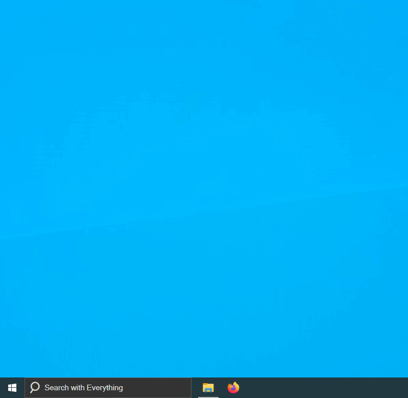

EverythingToolbar
=================

Everything integration for the Windows taskbar

Install
-------

- Download from [releases](https://github.com/stnkl/EverythingToolbar/releases)
- Extract it somewhere safe
- Run the `install.cmd` as admin
- Enable EverythingToolbar via the context menu of the taskbar

Uninstall
---------

- Run the `uninstall.cmd` as admin

Requirements
------------

- .NET >= 4.6.1
- Everything 1.4 must be running

Build
-----

- Install Visual Studio 2019 with .NET Framework 4.6.1 support
- Building the project will restart Windows Explorer
- Install the toolbar by running `EverythingToolbar/bin/Debug/install.cmd` as admin

Todo
----

- Light theme
- Search icon only
- Non-standard display scaling

Compatibility
-------------

Tested on/compatible with Windows 10 x64.